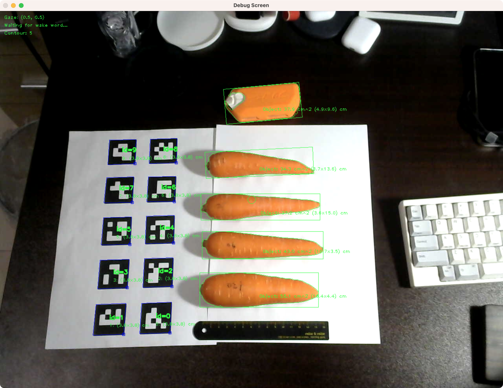

# VAs-got-vision

## Current screenshots


## How to use
1. Need to .env for compile and execute (changeme).
```
PICOVOICE_ACCESS_KEY=keyhere
PICOVOICE_MIC_INDEX=indexhere
```

2. ~ init command for generate markers.
3. ~ run command for execute.

## TODO

### Milestone
* Actors
  * [X] Core actor (message center)
    * [X] Unit test
  * [X] Audio actor
    * [X] Unit test
  * [X] Wake word actor
    * [ ] Unit test
    * [X] Picovoice Porcupine
  * [X] Speech to intents actor
    * [ ] Unit test
    * [X] Picovoice Rhino
  * [X] Voice activity detection actor
    * [X] Picovoice Cobra
  * [X] Text to speech actor
    * [ ] Unit test
    * [X] OnSpeechFinished callback (message)
    * [X] i18n text structure (en, ja, zh, ko)
  * [X] Camera actor
    * [X] Unit test
    * [X] Get frame from webcam
    * [X] Get frame from pupil labs (zmq)
  * [X] Computer Vision actor
    * [X] Unit test
    * [X] ArUco Marker detection
    * [X] Simple Object detection (based on colour. replace to YOLOv5?)
    * [X] Measure object size (Based on ArUco Marker)
  * [X] Gaze actor
    * [ ] Unit test
    * [X] Get gaze from pupil labs (zmq)
    * [X] Get gaze from frame center (fallback)
  * [X] Context actor
    * [X] Holding current context (task)
    * [X] Data flow for task
  * [X] Logger Actor
    * [ ] Unit test
    * [X] Log message to file
  * [ ] Input actor (for debug. keyboard input)
  * [ ] Stream actor (for recording)
  * [ ] Query actor (deprecated. for RPC)
* Task
  * [X] Task model base
  * [X] Cooking task structure
    * [X] Ingredient revision model
    * [X] (Cooking) Carrot salad Non-vision task
    * [X] (Cooking) Carrot salad vision task
