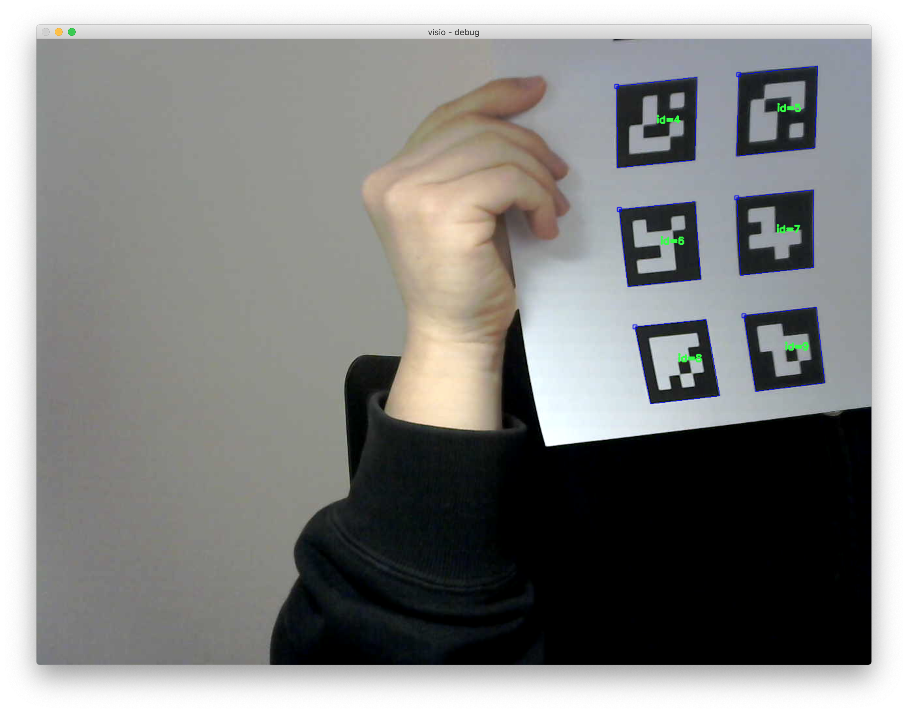
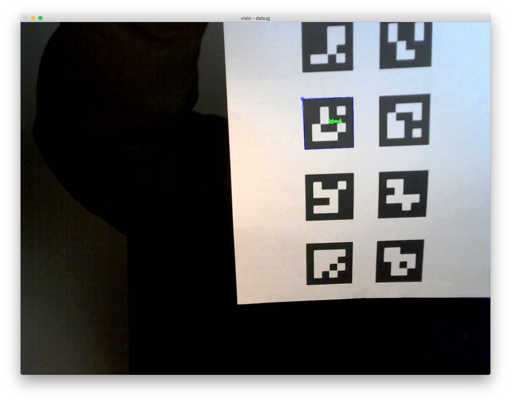

# VAs-got-vision

## Features
* Recognize Human voice (VAD).
* Execute marker detection process by Human voice.
* Detect ArUco Marker and find nearest from gaze (fallback is centroid of frame or 0,0).

## Current screenshots



## How to use
1. Need to .env for compile and execute (changeme).
```
PICOVOICE_ACCESS_KEY=keyhere
PICOVOICE_MIC_INDEX=indexhere
```

2. ~ init command for generate markers.
3. ~ run command for execute.

## TODO
* Order sentence recognition.
* Link to IoT device and Alexa API.
